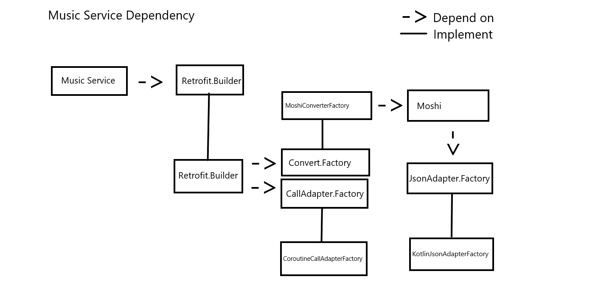

# NCSPlayer
 -  NCS.IO's android client player

## Tech
 - Kotlin
 - MVVM
 - DI(Hilt) Pattern
 
## Target
 1. 장르, 태그 별 검색
 2. 백엔드 서버 구현

## Dependency
 1. Music Service

## TODO
1. 유닛 테스트 환경 구축
2. ViewModel,Repo 구현 
3. 백엔드 서버 구현
